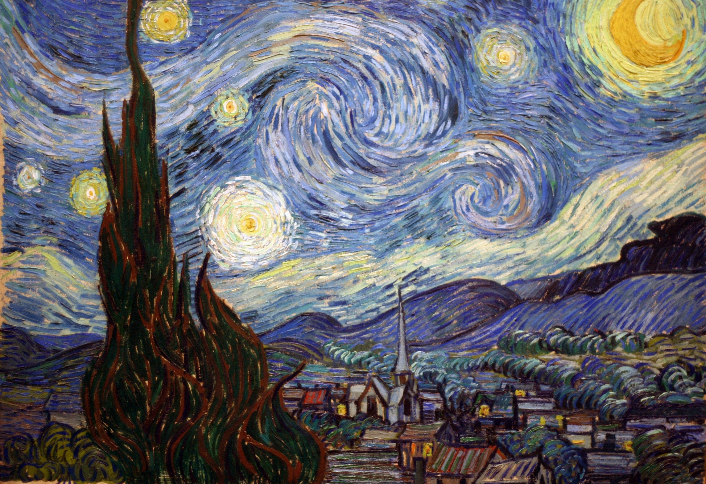

# StyleFusion神经风格迁移

使用 PyTorch 实现的**非实时图像风格迁移**。

图像风格迁移是深度学习中的一项有趣应用，它结合了两幅图像的内容和风格，创造出一幅新的图像。这项技术不仅在内容上保留了原始图像的特征，还在风格上融合了另一幅图像的艺术特质。

在本例中我们选择内容图像为：

风格图像为：

初始化目标图像为全噪声：

在内容与风格损失梯度的驱动下，迭代2000次后可以得到如下图所示的效果：

## 原理

不同于典型的深度学习项目，风格迁移不需要训练一个新模型，也不依赖于大规模数据集。它只需一个内容图像和一个风格图像即可实现风格的迁移。

### 特征提取

我们使用预训练的深度卷积神经网络（例如 VGG-19）作为特征提取器。在这里，我们主要使用网络中间的一些卷积层的输出，而忽略了用于分类的最后线性层。

- **内容特征**：内容特征通常直接来自特征提取器在某些层输出的特征图。

- **风格特征**：风格特征则来自特征提取器在某些层输出特征图沿着宽、高两个维度拉平后计算得到的格拉姆矩阵，格拉姆矩阵是沿着宽和高维度展平的特征图的内积矩阵，反映了不同特征间的相关性。由于点积运算的性质，计算得到的风格特征与特征图上的位置无关。

### 损失函数

- **内容损失**：衡量生成图像和内容图像在特征提取器的多个层的输出特征图之间的 L2 距离，对不同层的结果进行加权。

- **风格损失**：衡量生成图像和风格图像在特征提取器的多个层的输出特征图的格拉姆矩阵之间的 L2 距离，对不同层的结果进行加权。

### 优化过程

生成的图像最初是随机噪声图像。通过梯度下降算法，我们逐渐调整其像素值，以最小化内容损失和风格损失的组合。通过这种方式，生成的图像逐渐在内容上接近内容图像，同时在风格上接近风格图像。调整内容与风格损失的相对权重，可以控制生成图像的最终外观。

## 参考文献

本项目复现了以下论文的成果：
- Gatys, L. A., Ecker, A. S., & Bethge, M. (2016). Image Style Transfer Using Convolutional Neural Networks. In Proceedings of the IEEE Conference on Computer Vision and Pattern Recognition (CVPR).
该论文首次提出了使用卷积神经网络实现图像风格迁移的方法，并为后续的研究奠定了基础。
- 参考了AaronJny使用tensorflow的实现(https://github.com/AaronJny/DeepLearningExamples/tree/master/tf2-neural-style-transfer)
## 如何使用
`python main.py`

迭代结果输出路径：`./output`
