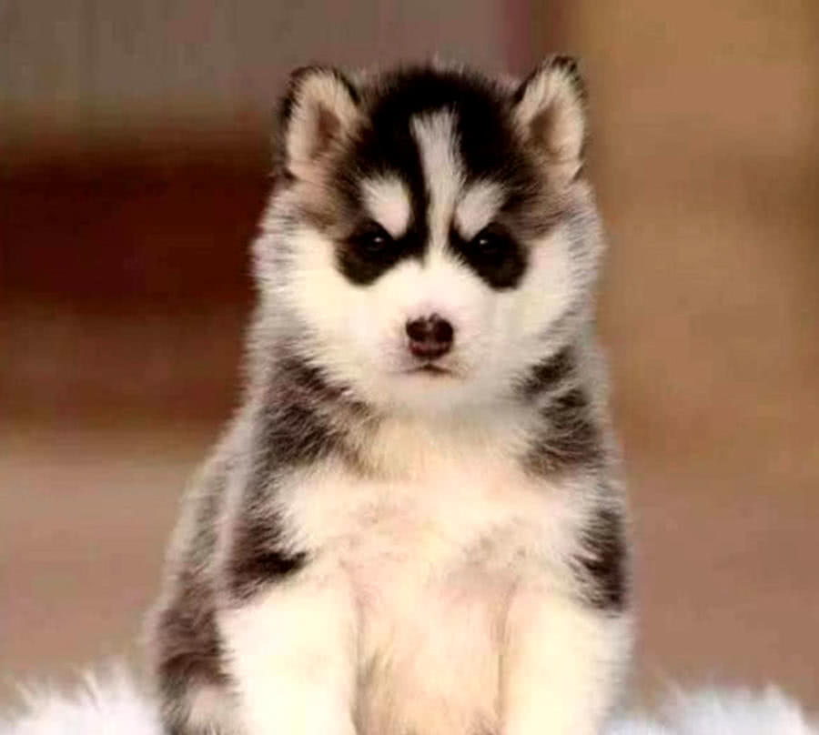
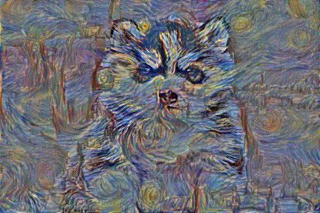
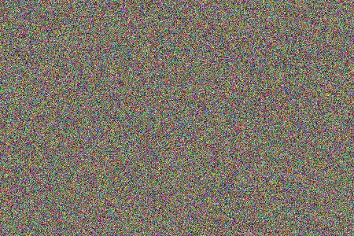

# StyleFusion神经风格迁移

使用 PyTorch 实现的神经风格迁移, 包括以下版本：
1. **非实时图像风格迁移**
2. **实时图像风格迁移**

## 图像风格迁移简介

---------
图像风格迁移是深度学习中的一项有趣应用，它结合了两幅图像的内容和风格，创造出一幅新的图像。这项技术不仅在内容上保留了原始图像的特征，还在风格上融合了另一幅图像的艺术特质。

比如我们选择内容图像为：



风格图像为：


融合第一张图像的内容和第二张图像的风格，可以得到如下图所示的效果：



### 特征提取

我们需要对一个图像的内容和风格进行量化，具体方法如下：
使用预训练的深度卷积神经网络（例如 VGG-19）作为特征提取器。在这里，我们主要使用网络中间的一些卷积层的输出，而忽略了用于分类的最后线性层。

- **内容特征**：内容特征通常直接来自特征提取器在某些层输出的**特征图**。

- **风格特征**：风格特征则来自特征提取器在某些层输出特征图沿着宽、高两个维度拉平后计算得到的**格拉姆矩阵**。格拉姆矩阵是沿着宽和高维度展平的特征图的内积矩阵，反映了不同特征间的相关性。由于点积运算的性质，计算得到的风格特征与特征图上的位置无关。

### 损失函数

然后就可以对两个图像之间的内容差异和风格差异进行量化，具体方法如下：

- **内容损失**：衡量生成图像和内容图像在特征提取器的多个层的输出特征图之间的 L2 距离，对不同层的结果进行加权。

- **风格损失**：衡量生成图像和风格图像在特征提取器的多个层的输出特征图的格拉姆矩阵之间的 L2 距离，对不同层的结果进行加权。


## 非实时图像风格迁移

---------
不同于典型的深度学习项目，非实时风格迁移不需要训练一个新模型，也不依赖于大规模数据集。它只需一个内容图像和一个风格图像即可实现风格的迁移。
图像生成以迭代方式进行，直接对目标图像进行优化。

- 优点是不需要单独训练模型，只需要利用预训练的vgg19网络进行特征提取，直接从噪声图像优化得到目标图像
- 缺点是需要多次迭代

初始化的噪声图像：



多次迭代，不断调整目标图像的像素值，使得内容损失和风格损失的加权减小，即可得到目标图像

## 实时图像风格迁移

---------
考虑到传统的非实时风格迁移方法需要多次迭代，生成一张风格迁移的图片需要大量时间。一个改进的方案是，使用神经网络直接生成目标图像，而不是从噪声优化得到。
- 优点是推理速度很快，能够直接生成风格迁移后的图片。甚至能够满足实时需要。 vgg特征提取器只在训练时使用到，在生成时只需要使用到生成网络即可。
- 单独训练一个模型用于直接生成目标图像需要在大规模内容图像数据上进行，这需要大量时间；且未经进一步改进的版本中，一个模型只能完成一种风格的迁移。

在生成网络训练时，在单独的风格图像和大规模内容图像上不断调整生成模型的参数，使得内容损失与风格损失的加权减小，即可得到风格图像生成网络

## 参考资料

---------
- 复现了以下论文的成果：Gatys, L. A., Ecker, A. S., & Bethge, M. (2016). Image Style Transfer Using Convolutional Neural Networks. In Proceedings of the IEEE Conference on Computer Vision and Pattern Recognition (CVPR).
该论文首次提出了使用卷积神经网络实现图像风格迁移的方法，并为后续的研究奠定了基础。
- 非实时风格迁移部分参考了AaronJny使用tensorflow的实现(https://github.com/AaronJny/DeepLearningExamples/tree/master/tf2-neural-style-transfer)

## 使用方法

---------
提供了一些基本的使用示例，详细参数请见源代码或使用--help 命令获取

一、非实时风格迁移：

```
python stylefusion.py --content_image ./data/city.jpg --style_image ./data/udnie.jpg --output_dir ./output/iterative_style_transfer --epochs 20 --steps_per_epoch 100
```
运行时每一个epoch完成后会将生成的图像保存至output_dir

二、实时风格迁移：

1. 模型训练：
```
python fast_style_transfer.py --mode train --style_image ./data/udnie.jpg --content_dataset data/train2014 --model_save_path ./models/new_model.pth --pretrained_model_path ./models/udnie.pth --epochs 10
```
2. 一次性处理若干个图像：
```
python fast_style_transfer.py --mode image --input_images_dir ./data/train2014/default_class --output_images_dir ./output/images_generated --model_path ./models/udnie.pth
```
3. 对视频进行风格迁移：
```
python fast_style_transfer.py --mode video --video_input data/maigua.mp4 --video_output output/videos/maigua_udnie.mp4 --model_path ./models/udnie.pth --batch_size 4
```